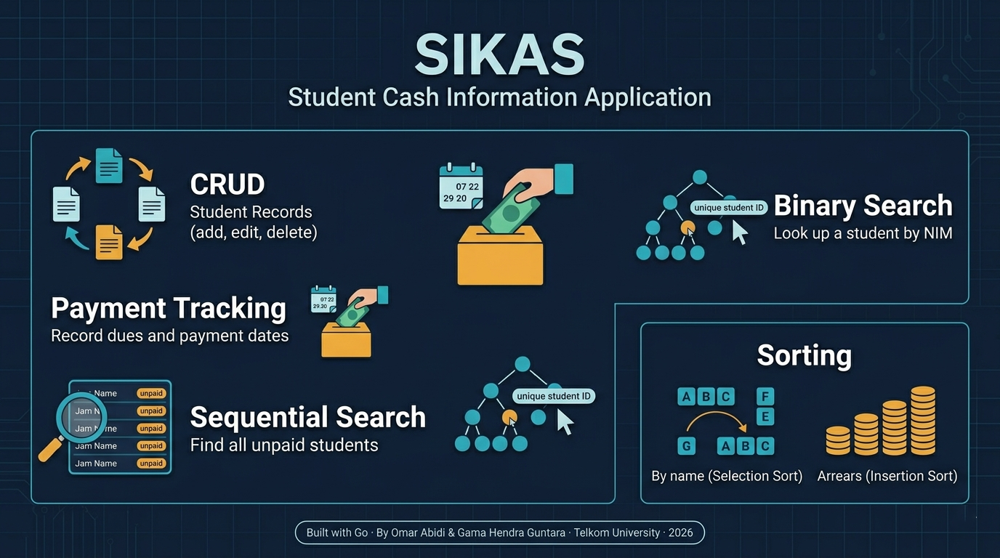

# SIKAS — Student Cash Information Application

> A terminal-based student dues management system written in Go, built for the **IF-49-INT** Programming Algorithm 2 practicum at Telkom University.



---

## Overview

SIKAS (Sistem Informasi Kas Mahasiswa) is a CLI application for managing student cash dues within a class. It supports full CRUD operations, payment recording, searching, sorting, and statistics — all implemented from scratch using fundamental data structure and algorithm concepts covered in the course.

---

## Features

| # | Feature | Algorithm / Concept |
|---|---------|---------------------|
| 1 | Add student(s) | Array insertion with NIM uniqueness validation |
| 2 | Edit student | Sequential Search by NIM |
| 3 | Delete student | Array shift (left compaction) |
| 4 | Record payment | In-place field update |
| 5 | Display all students | Linear traversal |
| 6 | Search unpaid students | Sequential Search on structured array |
| 7 | Search by NIM (payment check) | Binary Search (on NIM-sorted copy) |
| 8 | Sort by name | Selection Sort (ascending) |
| 8 | Sort by arrears | Insertion Sort (descending) |
| 9 | Statistics | Aggregation (total collected, paid/unpaid count) |

---

## Data Model

```go
type Student struct {
    nim         string  // student ID
    name        string  // full name
    totalDues   int     // total dues owed (IDR)
    paidAmount  int     // amount paid so far (IDR)
    lastPayDate string  // date of last payment (YYYY-MM-DD)
    hasPaid     bool    // true if dues fully settled
}
```

Storage is a fixed-size array of `NMAX = 100` students, declared as a named type:

```go
type StudentArray [NMAX]Student
```

---

## Getting Started

### Prerequisites

- [Go](https://go.dev/dl/) 1.18 or later

### Run

```bash
git clone https://github.com/<your-username>/sikas.git
cd sikas
go run sikas.go
```

### Build

```bash
go build -o sikas sikas.go
./sikas
```

---

## Usage

On launch you will see the splash screen, then the main menu:

```
+++ SIKAS - Student Cash Information Application +++
┌─────────────────────────────────────┐
│  1. ➕  Add student                  │
│  2. ✏️   Edit student                │
│  3. 🗑️   Delete student              │
│  4. 💰  Record payment               │
│  5. 📋  Show all students            │
│  6. 🔍  Search unpaid (Sequential)   │
│  7. 🎯  Search by NIM (Binary)       │
│  8. 🔃  Sort students                │
│  9. 📊  Show statistics              │
│  0. 🚪  Exit                         │
└─────────────────────────────────────┘
```

Type the menu number and press Enter. All inputs are read from stdin.

**Note on names:** Because `fmt.Scan` splits on whitespace, enter names as a single token (e.g. `JohnDoe`) or modify the input helper to use `fmt.Scanln` for multi-word names.

---

## Project Structure

```
sikas.go          # single-file application
README.md
```

All logic lives in `sikas.go`, organised into clearly commented sections:

```
Constants & Type Definitions
Input / Output Helpers
CRUD Operations
Searching (Sequential + Binary)
Sorting (Selection + Insertion)
Statistics
Main Menu
```

---

## Algorithm Notes

### Sequential Search
Used in two places: finding a student by NIM (edit, delete, payment) and scanning all records for unpaid students. Time complexity **O(n)**.

### Binary Search
Before searching, the array is copied and sorted ascending by NIM using Selection Sort. The binary search then runs in **O(log n)** on the sorted copy, leaving the original order untouched.

### Selection Sort
Sorts by student name (ascending). Finds the minimum element in the unsorted partition and swaps it into position. **O(n²)**.

### Insertion Sort
Sorts by arrears (`totalDues − paidAmount`) in descending order — useful for prioritising follow-ups. **O(n²)** worst case, **O(n)** best case on nearly-sorted data.

---

## Limitations

- Maximum 100 students (compile-time constant `NMAX`).
- Data is in-memory only — no file persistence between sessions.
- Multi-word names must be entered without spaces (limitation of `fmt.Scan`).

---

## Authors

Developed by **Omar Abidi** and **Gama Hendra Guntara**  
IF-49-INT · Bachelor of Informatics · Telkom University · 2026
= Task Distribution =
* Member 1 (Omar) : Program architecture, data model design, searching algorithms (sequential & binary search), sorting algorithms (selection sort), UI, GitHub documentation.
* Member 2 (Gamma) : the operations (add, edit, delete), payment recording module,, input/output helper functions, menu system, integration testing, statistics module, sorting algorithm (insertion sort).


---

## License

This project is submitted as academic coursework. Feel free to use it as a reference for learning Go or algorithm implementation.
